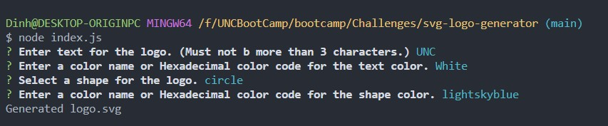
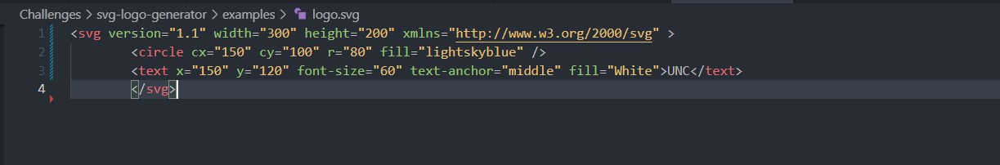
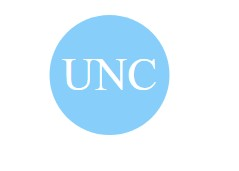
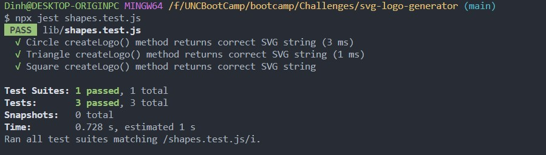

# SVG-Logo-Generator

## Description

This application allows you to generate a simple Logo using the command line. The Logo is created based on the user's input. By completing this project, I got the opportunity to practice more JS, Node.js, and use third-party libraries such as Jest, Inquirer, and Babel. This project also introduced me to new concepts such as creating objects using a class, inheritance, polymorphism, and Object Oriented Programming. 

One of the challenges I faced while completing this project was that I used ES6 syntax import and export for module management. I used ES6 instead of Common JS, because I wanted to use Inquirer 9.2.2, which handles ES6 only. The challenge came in when I had to create the tests for my classes. Since Jest does not handle ES6, I ran into errors when running Jest. To resolve these errors, I relied on Babel. I discovered that Babel is a JS compiler that allows developers to code using later ES syntax, by converting the code into a backward-compatible version. 

## Table of Contents
1. [Installation](#installation)
2. [Usage](#usage)
3. [Credits](#credits)
4. [Questions](#questions)  
5. [License](#license)

## Installation
- Download and install the Node.js LTS version from [Node.js](https://nodejs.org/en).
- Clone the repo using.
        
        git clone git@github.com:Dinh282/svg-logo-generator.git

- Or download the code from https://github.com/Dinh282/svg-logo-generator.git and open it with VS Code.
- Make sure you are in the root path of the project folder and then install dependencies for the project with:

        npm i

## Usage

- After installation, you can run the application with the following command:

        node index.js

- Command line prompts will ask you for information regarding the logo you would like to generate.
- Type in your answers and hit enter to move through the prompts. 
- Once you have gone through all of the questions, you should see a logo.svg file created in the example folder.
- If you would like a different logo, just run the application again and answer the prompts.
- There is a js file called shapes.test.js with codes that test the classes Triangle, Circle, and Square.
- Make sure you are in the path of the project folder and then you can run the test with the following command:

        npx jest shapes.test.js 

- The tests check if the methods of the three classes return the correct strings that are needed to create the SVG file. The three tests should all pass.

---

Video Demo of Application:

LINK GOES HERE.

 Screenshot of Command Line Prompts:

 Screenshot of Code For Generated Logo.svg File:

 Screenshot of Preview Of Generated Logo:

## Credits:

1. https://www.w3schools.com/graphics/svg_intro.asp (Help with SVG code)

2. https://www.rexegg.com/regex-quickstart.html (Help with regular expression)

3. https://johndecember.com/html/spec/colorsvg.html (SVG colors.)

4. https://babeljs.io/docs/configuration (Documentations for Babel. Help with setting up Babel)

5. https://www.npmjs.com/package/inquirer (Help with using Inquier library)

6. https://www.youtube.com/watch?v=7r4xVDI2vho (Youtube video that helps with understanding and using Jest)

7. https://jestjs.io/docs/getting-started (Documentation for Jest and Help with setting up Babel.)

8. Instructor, TAs, and classmates.

## Questions
Feel free to contact me at nguyen_dinh282@yahoo.com for additional information.  
Also, check out my other projects on [GitHub](https://github.com/Dinh282)

## License

Please refer to the LICENSE section in the repository.

---

